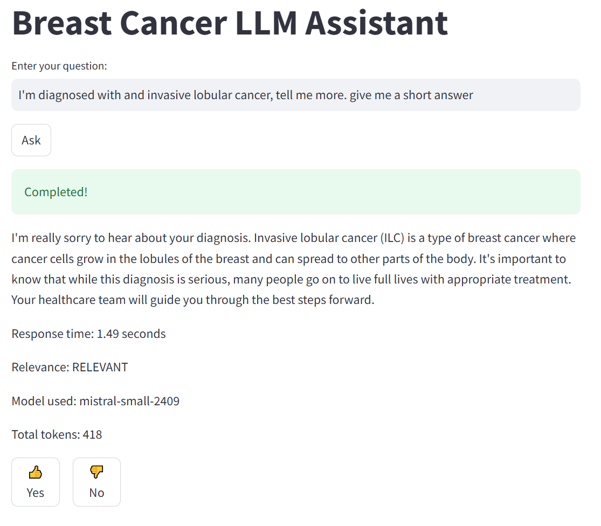

# Breast cancer partient assistant

# Project description

LLM based breast cancer assistant. Based on Agentic AI for database of knowledge generation and RAG for serving the
knowledge.

There are two scripts.

1. Agentic RAG

```
notebooks/priyanka_RAG_Crew_AI.ipynb
```

which helps to generate a database of knowledge which is later used in the process.

2. RAG

which serves the generated database.

Example questions

- I have breast cancer, please help me.
- I have 2 degree cancer, what can be done?



## How to run it?

Run docker compose up in the main directory.

```
docker compose up -d
```

logs are available

```
docker compose logs -f 
```

To switch it off

```
docker compose down
```

The DBs are initialised in init.dockerfile which is run in the main docker compose.

## Dataset

The dataset is generated using

```
notebooks/priyanka_RAG_Crew_AI.ipynb
```

# Technical description

## Ingestion

The ingestion is automated, when starting the app.
`app/app_init.py`

If you want to modify the questions/answers please refer to the file
`data/questions.json`

Data is uploaded to elasticsearch in two formats:

- raw text
- vector using `SentenceTransformer("multi-qa-distilbert-cos-v1")`

## Retrieval

Is done using semantic search.

The selected vector query is

```
query = {
  "field": "text_vector",
  "query_vector": vector_search_term,
  "k": 5,
  "num_candidates": 100
}
```

## LLM

The chosen LLM is Mistral AI.
https://mistral.ai/

I included a token for the review. I will expire soon. Use responsibly.

The token is stored in .env - if you want to change it.

## User interface

Streamlit - click below to chat with the assistant:

http://localhost:8501/

Don't forget to submit your feedback after each answer!

## Metrics

The rag is also constantly evaluated using LLM-as-judge - after each question asked by the user.

Metrics are stored in Postgres and shown in grafana with (5 charts).

After each run of the model there is a LLM model as a judge which evaluates the correctness of the answer (stored in the
db and visible in the dashboards)

Dashboards are created in the init.dockerfile.

To see the dashboards:

http://localhost:3000/

user: admin, password: admin


## Notebooks


