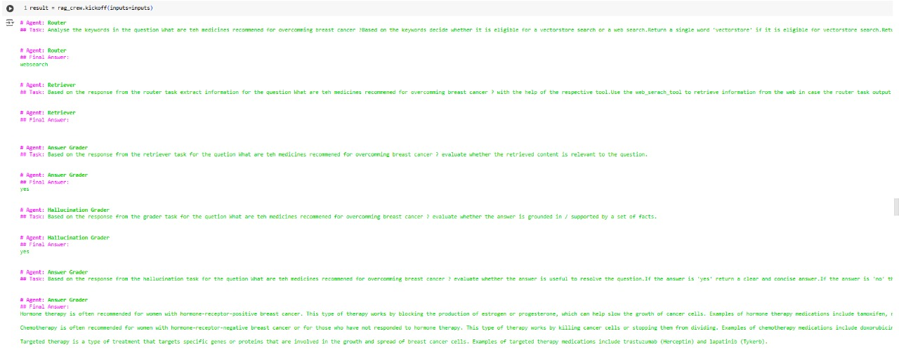
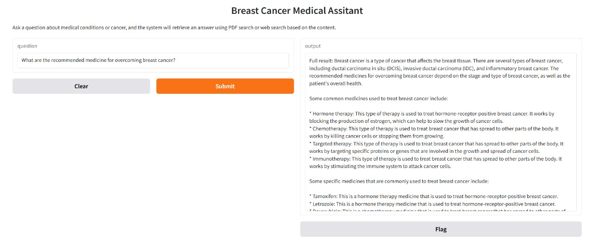
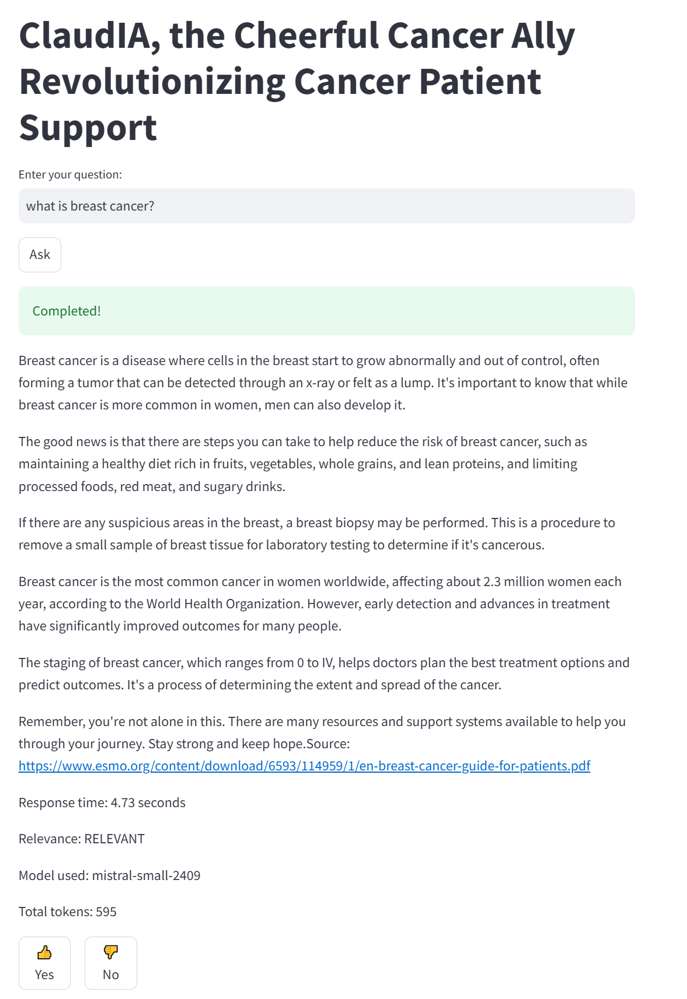

# Breast cancer partient assistant" par: "ClaudIA, the Cheerful Cancer Ally Revolutionizing Cancer Patient Support

# Overview

Project Description: ClaudIA empowers Cancer patients with: - Trusted, Personalized Knowledge - Engaging emotional
support - Community connections
- Scenario 1: Provides summarized and easy to understand answers to questions from cancer patients. Answers are sourced
from curated and medically validated content. Tone is empathetic. Simple language. Multilingual
- Scenario 2: Provides a video in 3 time formats to answer to questions from cancer patients. Videos are medical validated
and curated. LLM create 3 format types: 2 min, 10 min, 20 min. Multilingual
- Scenario 3: Detects users' mood with sentiment analysis. If the user's mood is negative, propose to cheer the user by
creating a humoristic Meme related to the issue shared by the user. Generate a prompt for a Meme creation related to the
topic, use image generation (E.g. Flux 01) to generate a Meme.
- Scenario 4: Retrieve and display events from patients' organisations and communities near to the user's location from
the social media platforms he set in his preferences. For the demo the tool retrieved news and events from Twitter
accounts of patient organisations and communities.

# Project description

LLM based breast cancer assistant. Based on Agentic AI for database of knowledge generation and RAG for serving the
knowledge.

There are two scripts.

## AGENTIC AI APPROACH

```
notebooks/priyanka_RAG_Crew_AI.ipynb
```

which helps to generate a database of knowledge which is later used in the process.




1. Environment Setup:
API Key Setup:
    - The code starts by importing necessary libraries and setting environment variables for two APIs: GROQ and Tavily.
    - The keys for these APIs are fetched from the userdata in Google Colab and set as environment variables using os.environ.

2. Initializing Language Model (LLM) and Tools:
Language Model (LLM):
The ChatOpenAI from langchain_openai is used to initialize the language model with settings: 
    - API Base: The base URL for the OpenAI API through GROQ.
    - Model: The code uses the "groq/llama3-8b-8192" model, a large language model for answering questions.
    - Temperature and Max Tokens: These parameters control the randomness of responses and the response length.

3. PDF Search Tool:
PDFSearchTool is initialized with a PDF (s41572-019-0111-2.pdf) and a configuration that specifies how to retrieve information from the document. The embedder and llm configurations define the embedding model and the language model used for generating answers.
4. Web Search Tool:
TavilySearchResults is used for web search, configured with k=3 to retrieve the top 3 search results.
5. Routing Tool:
    - The router_tool function is a simple logic tool that routes the user’s question to either a vectorstore search or a web search, based on keywords in the question.
    - If the question contains "Breast Cancer", it directs the question to the vectorstore (using PDF search). Otherwise, it directs the question to the web search.
6. Defining Agents:
    1) Router Agent:
    - This agent decides whether to use the vectorstore or web search based on the question.
    - It has a backstory to explain the role, helping it decide the appropriate tool for answering the question.
    - The agent uses the llm initialized earlier to perform decision-making tasks.

    2) Retriever Agent:
    - This agent is responsible for retrieving information once the question is routed by the Router Agent.
    - If the router directs to web search, the agent uses web_search_tool to retrieve information from the internet.
    - If the router directs to vectorstore, the agent uses rag_tool to search within the PDF.
   3) Grader Agent:
   This agent assesses the relevance of the retrieved documents. It checks whether the information retrieved is relevant to the user’s question and grades it accordingly.
7. Tasks:

    A) Router Task:
    - This task is responsible for analyzing the keywords in the user’s question and determining whether it’s suitable for a vectorstore search or a web search.
      - It returns either 'vectorstore' or 'websearch' as output, which is then used by the Retriever Agent.
    B) Retriever Task:
This task uses the output of the Router Task to decide which tool to use for retrieving information. If the result is 'websearch', it uses the web_search_tool, and if the result is 'vectorstore', it uses the rag_tool.
8. Crew Setup:
    - The Crew is created by combining the agents (Router_Agent, Retriever_Agent, and Grader_agent) and the tasks (router_task, retriever_task).
    - The Crew is responsible for executing the tasks in sequence and coordinating the agents to provide answers.
9. Gradio Interface:
    - The Gradio Interface is created to allow users to interact with the system via a web interface. Users can ask a question, and the system will process it using the RAG pipeline and return the result.
    - The interface has an input field for the question and an output field for displaying the answer.
10. Launching the Interface:
Finally, the iface.launch() command launches the Gradio interface, making it available for interaction.
    (author Pryianka)

---- 
## RAG 
which serves the generated database.

Example questions

- I have breast cancer, please help me.
- I have 2 degree cancer, what can be done?



## How to run it?

Run docker compose up in the main directory.

```
docker compose up -d
```

logs are available

```
docker compose logs -f 
```

To switch it off

```
docker compose down
```

The DBs are initialised in init.dockerfile which is run in the main docker compose.

## Dataset

The dataset is generated using

```
notebooks/priyanka_RAG_Crew_AI.ipynb
```

# Technical description

## Ingestion

The ingestion is automated, when starting the app.
`app/app_init.py`

If you want to modify the questions/answers please refer to the file
`data/questions.json`

Data is uploaded to elasticsearch in two formats:

- raw text
- vector using `SentenceTransformer("multi-qa-distilbert-cos-v1")`

## Retrieval

Is done using semantic search.

The selected vector query is

```
query = {
  "field": "text_vector",
  "query_vector": vector_search_term,
  "k": 5,
  "num_candidates": 100
}
```

## LLM

The chosen LLM is Mistral AI.
https://mistral.ai/

I included a token for the review. I will expire soon. Use responsibly.

The token is stored in .env - if you want to change it.

## User interface

Streamlit - click below to chat with the assistant:

http://localhost:8501/

Don't forget to submit your feedback after each answer!

## Metrics

The rag is also constantly evaluated using LLM-as-judge - after each question asked by the user.

Metrics are stored in Postgres and shown in grafana with (5 charts).

After each run of the model there is a LLM model as a judge which evaluates the correctness of the answer (stored in the
db and visible in the dashboards)

Dashboards are created in the init.dockerfile.

To see the dashboards:

http://localhost:3000/

user: admin, password: admin

## Notebooks


